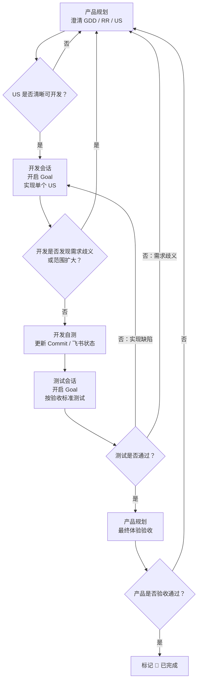

# PROJECT_XILI Codex 多会话协作流程

本文件定义 PROJECT_XILI 中三个专用 Codex 会话的协作方式：

```text
产品规划 -> 开发 -> 测试 -> 产品规划最终验收
```

所有会话都以飞书 DevOps 开发跟踪表、仓库文档和 Git commit 为共同真相源。

## 会话清单

| 会话 | Thread ID | 是否开启 Goal | 角色定位 |
|---|---|---|---|
| 产品规划 | `019ec6a5-47d7-70d1-af1c-bd0c5e114c8d` | 否 | Product Owner / Game Designer / 最终验收 |
| 开发 | `019ecbcc-087e-7600-9bac-abd53e880ff6` | 是 | Programmer / Implementer |
| 测试 | `019e30dc-d29f-7ef1-be61-4d7c58b0edbf` | 是 | QA / Verification |

## 角色职责

### 产品规划会话

负责：

- 与小黑讨论玩法、系统、GDD、RR、US。
- 将模糊想法整理为可开发的 US。
- 编写或更新用户故事、验收标准、非目标和优先级。
- 将 `READY` 状态的 US 派发给开发会话。
- 接收测试会话的测试结果。
- 做最终产品验收，并决定是否标记完成。

要求：

- 不直接修改代码。
- 不替开发决定实现细节，除非该细节影响玩法体验或验收标准。
- 不把未澄清需求直接派发给开发。
- 如果开发或测试反馈需求歧义，负责重新澄清并更新 US。

Goal 规则：

- 默认不开启 Goal。
- 只有在需要集中整理一份 GDD、拆一批 US 或做一次最终验收时，才临时开启 Goal。

### 开发会话

负责：

- 接收产品规划会话派发的单个 US。
- 读取对应 US、GDD、架构文档和开发流程。
- 按验收标准实现功能。
- 运行必要测试。
- 更新实现记录、Commit 字段和飞书状态。
- 完成后将任务交给测试会话。

要求：

- 必须开启 Goal。
- 一个 Goal 只处理一个 US。
- 不自行扩大需求范围。
- 不自行修改用户故事或验收标准。
- 如果发现需求不清、范围变大或验收标准不可测，停止开发并退回产品规划会话。
- 不跨 US 顺手开发其他功能。
- 涉及核心逻辑时必须运行同步和逻辑测试。
- 涉及 UI、Canvas、Cocos 或可玩流程时必须补充浏览器或 Playwright 验证。

Goal 完成条件：

- 代码实现完成。
- 自测通过。
- 必要测试已运行并记录。
- Commit 已关联 US。
- 飞书状态更新为 `🧪 待测试`。
- 已向测试会话发送测试交接信息。

### 测试会话

负责：

- 接收开发会话交付的待测 US。
- 根据 US 验收标准制定测试清单。
- 运行自动化测试、逻辑测试、浏览器测试或手工验证。
- 输出测试结果。
- 通过时交回产品规划会话最终验收。
- 不通过时将缺陷反馈给开发会话。

要求：

- 必须开启 Goal。
- 一个 Goal 只测试一个 US。
- 不自行修改需求。
- 不自行修代码，除非小黑明确要求测试会话也执行修复。
- 不因为“看起来合理”而替产品规划改变验收标准。
- 发现需求歧义时退回产品规划会话。
- 发现实现缺陷时退回开发会话。

Goal 完成条件：

- 验收标准逐条验证完成。
- 测试命令、结果、截图或报告路径已记录。
- 若通过，飞书状态更新为 `✅ 测试通过`，并通知产品规划。
- 若不通过，输出可复现缺陷反馈，并通知开发。

## 标准流转

### 1. 产品规划 -> 开发

产品规划会话向开发会话发送：

```text
【开发交接】

US编号：
关联RR：
标题：
需求文档：
GDD / 设计文档：
验收标准：
非目标：
优先级：
当前状态：
建议测试方式：
完成后交给：测试会话 019e30dc-d29f-7ef1-be61-4d7c58b0edbf

请开启 Goal，只实现这个 US。
如果需求不清或范围需要扩大，停止开发并退回产品规划会话。
```

### 2. 开发 -> 测试

开发会话向测试会话发送：

```text
【测试交接】

US编号：
关联RR：
标题：
实现摘要：
Commit：
变更文件：
已运行测试：
未验证风险：
验收标准：
测试重点：
完成后交给：产品规划会话 019ec6a5-47d7-70d1-af1c-bd0c5e114c8d

请开启 Goal，只测试这个 US。
如果发现需求歧义，退回产品规划。
如果发现实现缺陷，退回开发会话。
```

### 3. 测试 -> 产品规划

测试会话向产品规划会话发送：

```text
【验收交接】

US编号：
关联RR：
标题：
测试结论：通过 / 不通过
测试范围：
已运行测试：
验收标准逐条结果：
缺陷列表：
截图 / 报告路径：
建议状态：

请产品规划做最终体验验收。
```

### 4. 测试 -> 开发

测试不通过时，测试会话向开发会话发送：

```text
【缺陷反馈】

US编号：
关联RR：
标题：
缺陷等级：
复现步骤：
实际结果：
期望结果：
相关验收标准：
日志 / 截图 / 报告路径：

请继续使用原 Goal 或新 Goal 修复该 US，不要扩大范围。
```

## 状态规则

| 阶段 | 飞书状态 |
|---|---|
| 产品规划创建或澄清 US | `📋 规划中` 或 `🟡 待开发` |
| 开发开始 | `🔵 开发中` |
| 开发完成并交测 | `🧪 待测试` |
| 测试通过 | `✅ 测试通过` |
| 产品最终验收并确认完成 | `🎉 已完成` |

## 硬性边界

- 产品规划不直接写代码。
- 开发不自行扩需求。
- 测试不自行改需求。
- 开发和测试必须开启 Goal。
- 产品规划默认不开 Goal。
- 一个开发 Goal 只对应一个 US。
- 一个测试 Goal 只对应一个 US。
- 需求歧义回产品规划。
- 实现缺陷回开发。
- 最终是否完成由产品规划决定。

## Test Plan

### 流程图



### 检查项

- [ ] 三个 Thread ID 与 Codex 线程列表一致。
- [ ] 文档明确写出只有开发和测试需要开启 Goal。
- [ ] 交接模板覆盖产品规划到开发、开发到测试、测试到产品规划、测试到开发。
- [ ] 角色边界包含：产品不写代码、开发不扩需求、测试不改需求。
- [ ] 状态流转与 `docs/DEV_FLOW_FEISHU.md` 一致。

## 推荐使用方式

当前项目管理会话负责协调和维护流程文档。

如果需要跨会话派发任务，优先由产品规划会话发起；项目管理会话可辅助生成交接单，但不替代产品规划的最终需求判断。
